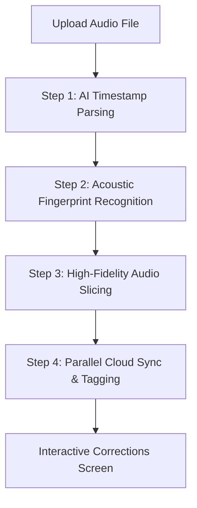

# 🌊 AudioWave — Futuristic AI Mixtape Splitter & Audio Editor

AudioWave is a premium, open-source, full-stack audio processing toolkit designed to run seamlessly in the browser. It combines a high-fidelity **Zero-Latency Waveform Editor** with an intelligent **AI Mixtape Splitter** that can segment hour-long YouTube mixtapes, recognize tracks using acoustic fingerprinting, and bundle them into high-quality tagged packages instantly.

---

## ✨ Features

### 🎧 Zero-Latency Waveform Editor
* **Browser-Native Processing:** Built using the standard Web Audio API and Wavesurfer.js.
* **100% Offline Privacy:** Audio files are loaded, visualised, and processed completely on your local machine. No servers involved.
* **Interactive Control:** Cut, trim, merge, adjust fade-ins/fade-outs, and zoom in/out with fluid micro-animations.

### 🤖 AI-Powered Mixtape Splitter
* **Guided Pipeline:** Upload long mixtapes or YouTube audio downloads and split them automatically in minutes.
* **LLM Boundary Detection:** Harnesses deep learning models (via OpenRouter/DeepSeek) to read video metadata, descriptions, tracklist comments, and transcripts to locate precise transitions.
* **Acoustic Audio Fingerprinting:** Queries ACRCloud's international database of 100+ million music tracks to auto-detect and tag songs with official artist, track name, and metadata.
* **Smart Corrections Board:** Review AI-detected transitions, play individual segments, adjust endpoints, rename titles, and correct tags.
* **Parallel Cloud Sync:** Automatically backs up and syncs split files in parallel to Cloudinary, ensuring complete reliability.

---

## 🛠️ Technology Stack

| Component | Technology | Description |
|---|---|---|
| **Frontend Framework** | [Next.js 14](https://nextjs.org) | App Router, TypeScript, dynamic server-rendered pages. |
| **Styling & Animations** | [Tailwind CSS](https://tailwindcss.com) + [Framer Motion](https://motion.dev) | Beautiful glassmorphic UI, fluid layouts, and scroll-reactive animations. |
| **Audio Visualization** | [Wavesurfer.js](https://wavesurfer.xyz) | Web Audio API-powered audio visualization and controls. |
| **Backend API** | [FastAPI](https://fastapi.tiangolo.com) | Python 3.11+ high-performance web framework. |
| **Task Queue & Processors** | `librosa` + `pydub` + `scipy` | Core Python libraries for acoustic fingerprint extraction and audio slicing. |
| **Music Recognition** | [ACRCloud API](https://www.acrcloud.com) | Real-time international audio identification. |
| **Database & Auth** | [Google Firebase](https://firebase.google.com) | Firestore for persistent user profile data, credentials sync, and active processing job tracking. |
| **Media Hosting** | [Cloudinary](https://cloudinary.com) | High-speed CDN for backup storage and parallel audio downloads. |

---

## 📂 Project Architecture

```
song_splitter/
├── app/                  # Next.js frontend pages (App Router)
│   ├── welcome/          # Dynamic scroll-reactive Landing page
│   ├── editor/           # Browser-native local Audio Editor
│   └── generator/        # Multi-stage AI Mixtape Splitter pipeline
├── backend/              # FastAPI backend application
│   ├── main.py           # Core FastAPI API routes and SSE pipelines
│   ├── pipeline.py       # 4-stage mixtape processing pipeline
│   ├── firebase_init.py  # Firestore connection and user tokens
│   └── requirements.txt  # Python backend dependencies
├── components/           # Reusable Next.js React UI components
├── hooks/                # React custom hooks (e.g. useAuth)
├── lib/                  # Shared helper functions and API adapters
└── README.md             # Repository documentation
```

---

## 🚀 Local Quickstart Guide

To host both the frontend and backend locally on your system, follow the step-by-step guide below.

### Prerequisites
* **Node.js:** v18.0 or higher
* **Python:** v3.11 or higher
* **FFmpeg:** Installed on your system path (required for backend audio splitting)

---

### Step 1: Clone the Repository
```bash
git clone https://github.com/your-username/audiowave.git
cd audiowave
```

### Step 2: Configure Backend Environment
1. Navigate to the `/backend` folder:
   ```bash
   cd backend
   ```
2. Create a virtual environment and activate it:
   ```bash
   python -m venv .venv
   
   # Windows:
   .venv\Scripts\activate
   
   # macOS/Linux:
   source .venv/bin/activate
   ```
3. Install dependencies:
   ```bash
   pip install -r requirements.txt
   ```
4. Create a `.env` file in the `/backend` directory:
   ```ini
   # Firebase Settings (Server Side Admin SDK)
   FIREBASE_PROJECT_ID=your-project-id
   FIREBASE_PRIVATE_KEY_B64=your-base64-encoded-service-account-key
   FIREBASE_CLIENT_EMAIL=your-client-email
   
   # Cloudinary Media Storage CDN
   CLOUDINARY_CLOUD_NAME=your-cloud-name
   CLOUDINARY_API_KEY=your-api-key
   CLOUDINARY_API_SECRET=your-api-secret
   ```

### Step 3: Configure Frontend Environment
1. Return to the root folder and create a `.env.local` file:
   ```ini
   # Firebase Public Web Configuration
   NEXT_PUBLIC_FIREBASE_API_KEY=your-api-key
   NEXT_PUBLIC_FIREBASE_AUTH_DOMAIN=your-auth-domain
   NEXT_PUBLIC_FIREBASE_PROJECT_ID=your-project-id
   NEXT_PUBLIC_FIREBASE_MESSAGING_SENDER_ID=your-sender-id
   NEXT_PUBLIC_FIREBASE_APP_ID=your-app-id
   
   # Backend Connection Endpoint
   NEXT_PUBLIC_BACKEND_URL=http://localhost:8000
   ```
2. Install dependencies:
   ```bash
   npm install
   ```

---

### Step 4: Run Both Servers Simultaneously

#### Start the FastAPI Backend
From the `/backend` directory:
```bash
uvicorn main:app --host 127.0.0.1 --port 8000 --reload
```
You can verify the backend is running by opening: `http://127.0.0.1:8000/health`.

#### Start the Next.js Frontend
From the root directory:
```bash
npm run dev
```
Open **[http://localhost:3000](http://localhost:3000)** in your browser!

---

## ⚡ The AI Splitting Pipeline

When you process a mixtape, AudioWave runs a 4-step pipeline to extract separate tracks:



1. **Step 1: Timestamp Analysis:** The backend reads description tags and parses comments to build an initial track boundary list using LLM reasoning.
2. **Step 2: Fingerprint Extraction:** Computes acoustic signatures and matches them against database items via the ACRCloud Web API.
3. **Step 3: Audio Slicing:** Uses ffmpeg and `pydub` to slice the large file at precise, cross-faded coordinates.
4. **Step 4: Cloud Sync:** Uploads tracks in parallel to Cloudinary, then returns a complete corrections board for the user to review, edit, and package as a ZIP download.

---

## 🤝 Contribution Guide

We welcome contributions from developers of all experience levels!
1. **Fork the repository** on GitHub.
2. Create a new feature branch (`git checkout -b feature/awesome-feature`).
3. Commit your changes with descriptive messages (`git commit -m 'feat: add support for FLAC formats'`).
4. Push to your branch (`git push origin feature/awesome-feature`).
5. Open a **Pull Request** detailing what was modified and why.

---

## 📄 License
This project is licensed under the MIT License — see the [LICENSE](LICENSE) file for details.
